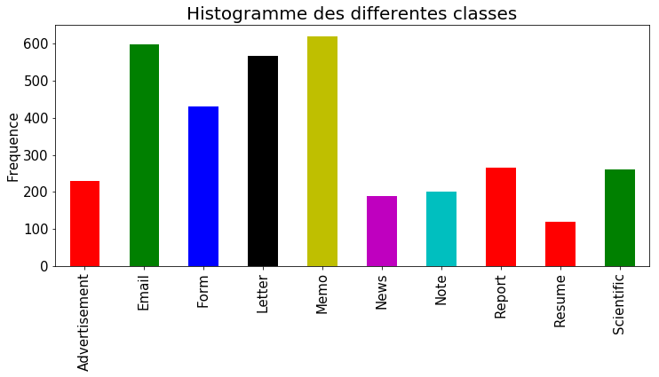

# Classification des documents du procès des groupes américains du tabac

- **Auteur : Anass EL YAAGOUBI, Text Analysis, 22/12/2018**

## Introduction au problème et Analyse des données

Une fois les documents numérisés et passés à l'OCR et que nous avons à notre disposition des données labellisées nous pourrons alors mettre en place un modèle de classification, permettant ainsi de reconnaître automatiquement la catégorie de chaque document.

Après avoir chargé nos données on peut remarquer que l'on dispose de 10 classes de documents :

* Advertisement: 230
* Email: 599
* Form: 431
* Letter: 567
* Memo: 620
* News: 188
* Note: 201
* Report: 265
* Resume: 120
* Scientific: 261

Les catégories ne sont pas toutes représentées de la même manière, certaines contiennent plus de documents que d'autres.

Nous devons donc mettre en place un outil de classification. Dans un premier temps nous devrons entraîner différents modèles et ensuite nous devrons les tester afin de sélectionner le meilleur.

## Solutions proposées :

* MultinomialNB
* MLP

### MultinomialNB

Notre problème de classification de textes est un problème très commun. Une des méthode les plus connus pour le résoudre consiste à entraîner un modèle Naive Bayes à partir de la représentation des textes sous le format vectoriel (plongement des mots dans un espace vectoriel) obtenu grâce à la représentation en Sacs de Mots puis à la normalisation TF IDF.

Pour entraîner et évaluer ce modèle nous procédons de manière classique, d'abord nous l’entraînons sur des données d'entraînement puis nous l'évaluons sur des données de test en analysant les métriques classiques (précision, rappel etc.) ainsi qu'en visualisant la matrice de confusion (MultinomialNB).

|              |precision|recall|f1-score|support|
|:-------------|:-------:|:----:|:------:|:-----:|
|Advertisement |  0.85   | 0.70 |  0.77  |  47   |
|Email         |  0.93   | 0.91 |  0.92  | 129   |
|Form          |  0.79   | 0.8  |  0.81  |  78   |
|Letter        |  0.75   | 0.65 |  0.69  | 122   |
|Memo          |  0.51   | 0.79 |  0.62  | 107   |
|Note          |  0.45   | 0.33 |  0.38  |  30   |
|News          |  0.81   | 0.81 |  0.81  |  43   |
|Report        |  0.66   | 0.32 |  0.43  |  60   |
|Resume        |  1.00   | 1.00 |  1.00  |  25   |
|Scientific    |  0.64   | 0.70 |  0.67  |  56   |
|avg / total   |  0.74   | 0.73 |  0.72  | 697   |

Ainsi nous pouvoir voir que la précision globale est de 74%, certaines classes sont moins bien prédites contrairement à d'autres. Par exemple la classe Resume est bien prédite à 100% alors que la classe Note et Memo sont à 45% 51%.

Nous pouvons ici visualiser la matrice de confusion pour comparer les différentes classes :

### Multi Layer Perceptron (MLP)

Le modèle MLP est un des premier modèles utilisé en réseaux de neurones artificiel. On peut le voir comme une généralisation de la régression logistique (une couche avec une sigmoid en activation). Ce modèle peut être utilisé pour la régression comme la classification, ici nous allons l'utilisé pour classifier nos données textuelles.
Comme pour le premier modèle nous allons entraîner celui-ci sur les données d'entraînement puis nous l'évaluons sur les données de test :

|              |precision|recall|f1-score|support|
|:-------------|:-------:|:----:|:------:|:-----:|
|Advertisement | 0.76    |  0.68| 0.72   |    47 |
|Email         | 0.97    |  0.91| 0.94   |   129 |
|Form          | 0.74    |  0.88| 0.81   |    78 |
|Letter        | 0.78    |  0.74| 0.76   |   122 |
|Memo          | 0.72    |  0.86| 0.78   |   107 |
|Note          | 0.63    |  0.57| 0.60   |    30 |
|News          | 0.88    |  0.81| 0.84   |    43 |
|Report        | 0.53    |  0.43| 0.48   |    60 |
|Resume        | 1.00    |  1.00| 1.00   |    25 |
|Scientific    | 0.68    |  0.70| 0.69   |    56 |
|avg / total   | 0.78    |  0.78| 0.78   |   697 |

Nous pouvons remarquer ici que les résultats sont globalement meilleurs avec une précision de 78%. certaines classes sont mieux classifier avec ce modèle, c'est le cas pour Note et Memo notamment, en revanche la classe Form est moins bien classifiée.

Nous pouvons ici visualiser la matrice de confusion pour comparer les différentes classes :

## Conclusion

Nous avons testé deux classificateurs différents Naive Bayes et MLP, nous avons évalué la performance de chaque algorithme sur les données de test. Certains Hyper paramètres ont été choisis manuellement pour donner de meilleurs résultats. Nous avons montré dans ce cas pratique que le modèle MLP donne de meilleurs résultats globalement que Naive Bayes.

Dans la suite on pourrait imaginer un modèle hybride utilisant les deux modèles de sorte à ne garder que les points forts pour chaque algorithme. Il serait judicieux de réaliser automatiquement la sélection des hypers paramètres en utilisant des données de validation. On pourrait également tester d'autres modèle telles que les SVM (avec un noyau RBF) ou les réseaux de neurones profonds.
